# SharpSDL3 Architecture

## Overview

SharpSDL3 is a C# binding library for SDL3 (Simple DirectMedia Layer 3). It
provides managed wrappers around the native SDL3 C API using .NET 9's
`LibraryImport` source-generated P/Invoke. The library is organized into
functional subsystems that mirror SDL3's own module structure.

---

## Architecture Diagram

```mermaid
graph TB
    subgraph Application Layer
        APP[Your Application]
    end

    subgraph SharpSDL3 Managed Layer
        direction TB

        subgraph Core["Core (Sdl.cs — 7,883 lines)"]
            INIT[Init / Quit / Version]
            MARSHAL[StructureToPointer / PointerToStructure]
            PROPS[Properties / Hints]
            THREAD[Threads / TLS]
        end

        subgraph Graphics["Graphics & Rendering"]
            RENDER[Render.cs — 2,583 lines<br/>Create/Destroy Renderer<br/>Draw Primitives, Viewport]
            GPU[Gpu.cs — 2,186 lines<br/>Command Buffers, Pipelines<br/>Shaders, Compute]
            TEX[Textures.cs — 751 lines<br/>Create/Update Textures<br/>Texture Properties]
            SURFACE[Surface Operations<br/>Blit, Convert, Fill]
            GL[OpenGL.cs — 275 lines<br/>GL Context Management]
            MTL[Metal.cs — 38 lines]
        end

        subgraph Input["Input Devices"]
            MOUSE[Mouse.cs — 566 lines<br/>Cursor, State, Warp]
            KB[Keyboard / Text Input]
            GAMEPAD[GamePad.cs — 1,484 lines<br/>Mappings, Axes, Buttons]
            JOY[JoySticks.cs — 1,425 lines<br/>Axes, Hats, Balls, Power]
            HAPTIC[Haptic.cs — 759 lines<br/>Force Feedback Effects]
            TOUCH[Touch.cs — 129 lines]
            HID[HID.cs — 287 lines]
            SENSOR[Sensors.cs — 283 lines]
        end

        subgraph Audio["Audio"]
            AUD[Audio.cs — 1,382 lines<br/>Devices, Streams<br/>Format Conversion]
        end

        subgraph Events["Event System"]
            EVT[Events.cs — 483 lines<br/>Poll, Filter, Watch]
            LOG[Logger.cs — 430 lines<br/>Priority Levels, Output]
            ASSERT[Assertion.cs — 165 lines]
        end

        subgraph FileIO["File I/O & Storage"]
            IO[IO.cs — 889 lines<br/>Stream Abstraction]
            STORE[Storage.cs — 482 lines<br/>Title/User/File Storage]
            FS[FileSystem.cs — 204 lines]
            ASYNC[AsyncIO.cs — 282 lines]
            DIALOG[FileDialog.cs — 97 lines]
        end

        subgraph System["System & Platform"]
            SYS[System.cs — 336 lines<br/>DateTime, Power, Locale]
            CPU[CpuInfo.cs — 316 lines<br/>SIMD, Cache, Threads]
            PLAT[Platform.cs — 271 lines]
            TIMER[Timer.cs — 237 lines]
        end

        subgraph Sync["Synchronization"]
            MUTEX[Mutex.cs — 554 lines]
            ATOM[Atomic.cs — 332 lines]
            SEM[Semaphore.cs — 79 lines]
        end

        subgraph UI["User Interface"]
            TRAY[Tray.cs — 597 lines<br/>System Tray Menus]
            MBOX[MessageBox.cs — 208 lines]
            CAM[Camera.cs — 387 lines]
        end

        subgraph Extensions["Extension Libraries"]
            IMG[Image/<br/>SDL3_image bindings<br/>PNG, JPG, WebP loading]
            MIX[Mixer/<br/>SDL3_mixer bindings<br/>Music, Chunks, Channels]
            TTF[TTF/<br/>SDL3_ttf bindings<br/>Font Rendering, Glyphs]
        end

        subgraph DataTypes["Shared Data Types"]
            STRUCTS[Structs/ — 128 files<br/>Rect, Color, Event,<br/>AudioSpec, Surface, ...]
            ENUMS[Enums/ — 114 files<br/>EventType, PixelFormat,<br/>WindowFlags, BlendMode, ...]
            CONST[Constants.cs — 583 lines<br/>SDL Property Strings]
            DEL[Delegates.cs — 101 lines<br/>Callback Signatures]
            BOOL[SdlBool, SdlException<br/>Marshallers]
        end
    end

    subgraph Native["Native SDL3 (C Library)"]
        SDL3[libSDL3.so / SDL3.dll / libSDL3.dylib]
        SDL3_IMG[SDL3_image]
        SDL3_MIX[SDL3_mixer]
        SDL3_TTF[SDL3_ttf]
    end

    APP --> Core
    APP --> Graphics
    APP --> Input
    APP --> Audio
    APP --> Events
    APP --> FileIO
    APP --> UI
    APP --> Extensions

    Core --> DataTypes
    Graphics --> DataTypes
    Input --> DataTypes
    Audio --> DataTypes
    Events --> DataTypes
    FileIO --> DataTypes
    System --> DataTypes
    Sync --> DataTypes
    UI --> DataTypes
    Extensions --> DataTypes

    Graphics -.->|LogError| LOG
    Input -.->|LogError| LOG
    Audio -.->|LogError| LOG
    FileIO -.->|LogError| LOG
    UI -.->|LogError| LOG

    RENDER --- TEX
    RENDER --- SURFACE

    Core -->|LibraryImport P/Invoke| SDL3
    Graphics -->|LibraryImport P/Invoke| SDL3
    Input -->|LibraryImport P/Invoke| SDL3
    Audio -->|LibraryImport P/Invoke| SDL3
    Events -->|LibraryImport P/Invoke| SDL3
    FileIO -->|LibraryImport P/Invoke| SDL3
    System -->|LibraryImport P/Invoke| SDL3
    Sync -->|LibraryImport P/Invoke| SDL3
    UI -->|LibraryImport P/Invoke| SDL3
    IMG -->|LibraryImport P/Invoke| SDL3_IMG
    MIX -->|LibraryImport P/Invoke| SDL3_MIX
    TTF -->|LibraryImport P/Invoke| SDL3_TTF
```



---

## Functional Groupings

### Core (`Sdl.cs` — 7,883 lines)

The central file containing the main `Sdl` partial class. Holds initialization,
version queries, property management, hint system, thread creation, and the bulk
of P/Invoke declarations. All other `.cs` files extend this same partial class.

| Responsibility | Methods |
|---|---|
| Init / Quit lifecycle | `Init`, `Quit`, `WasInit` |
| Version | `VersionNum`, `GetVersion`, `GetRevision` |
| Memory marshalling | `StructureToPointer<T>`, `PointerToStructure<T>`, `Free` |
| Properties | `CreateProperties`, `SetProperty`, `GetProperty`, `EnumerateProperties` |
| Hints | `SetHint`, `GetHint`, `AddHintCallback`, `RemoveHintCallback` |
| Window management | `CreateWindow`, `DestroyWindow`, `CreatePopupWindow` |
| Surface operations | `CreateSurface`, `BlitSurface`, `ConvertSurface`, `FillSurfaceRect` |
| Threads | `CreateThread`, `DetachThread`, `WaitThread` |
| Clipboard | `SetClipboardData`, `GetClipboardText`, `ClearClipboardData` |

### Graphics & Rendering (3,833 lines total)

| File | Responsibility |
|---|---|
| `Render.cs` | 2D rendering context — create/destroy renderers, draw lines/rects/points, set viewport, render targets, Vulkan semaphores |
| `Gpu.cs` | Low-level GPU pipeline — command buffers, shader programs, compute pipelines, buffer/texture management |
| `Textures.cs` | Texture lifecycle — create from surface/file, update pixels, lock/unlock, query properties |
| `OpenGL.cs` | OpenGL context creation, attribute management, swap buffers |
| `Metal.cs` | Metal layer access for macOS/iOS rendering |

### Input Devices (4,933 lines total)

| File | Responsibility |
|---|---|
| `Mouse.cs` | Mouse state, cursor management, relative mode, warp, capture |
| `GamePad.cs` | Standard gamepad mapping, axis/button queries, rumble, LED, touchpad |
| `JoySticks.cs` | Raw joystick access — axes, hats, balls, battery, virtual joysticks |
| `Haptic.cs` | Force feedback effects — rumble, periodic, constant, ramp, custom |
| `HID.cs` | Generic HID device enumeration and raw I/O |
| `Touch.cs` | Multi-touch finger tracking |
| `Sensors.cs` | Accelerometer, gyroscope data |

### Audio (1,382 lines)

Single file (`Audio.cs`) covering device enumeration, audio stream creation,
format conversion, recording, and callback-driven playback. Operates on
`AudioSpec` structs for format negotiation.

### Event System (1,078 lines total)

| File | Responsibility |
|---|---|
| `Events.cs` | Event queue polling, filtering, watchers, flush, type enable/disable |
| `Logger.cs` | Log priority per category, custom output functions, built-in log levels |
| `Assertion.cs` | Assertion handler registration, failure reporting |

### File I/O & Storage (1,954 lines total)

| File | Responsibility |
|---|---|
| `IO.cs` | `IoStream` abstraction — read/write/seek on files, memory, and dynamic buffers |
| `Storage.cs` | Platform storage containers — title storage, user storage, file enumeration |
| `FileSystem.cs` | Base path, pref path, directory enumeration, glob matching |
| `AsyncIO.cs` | Non-blocking file read/write with completion status |
| `FileDialog.cs` | Native open/save file dialogs |

### Synchronization (965 lines total)

| File | Responsibility |
|---|---|
| `Mutex.cs` | Mutex, condition variable, and read-write lock lifecycle |
| `Atomic.cs` | Lock-free atomic int/pointer operations, compare-and-swap |
| `Semaphore.cs` | Counting semaphore (wait, post, try-wait) |

### System & Platform (1,160 lines total)

| File | Responsibility |
|---|---|
| `System.cs` | Date/time, locale, power state, URLs, environment variables |
| `CpuInfo.cs` | CPU count, cache line size, SIMD feature detection (SSE, AVX, NEON) |
| `Platform.cs` | OS name, screen DPI, preferred locales |
| `Timer.cs` | High-resolution timer, delay, periodic callbacks |

### User Interface (1,192 lines total)

| File | Responsibility |
|---|---|
| `Tray.cs` | System tray icon, menu items, checkboxes, submenus, callbacks |
| `MessageBox.cs` | Modal alert dialogs with buttons and color schemes |
| `Camera.cs` | Camera device enumeration, frame capture, format queries |

### Extension Libraries

| Directory | Native Library | Responsibility |
|---|---|---|
| `Image/` | SDL3_image | Load PNG, JPG, WebP, BMP, GIF; animated image support |
| `Mixer/` | SDL3_mixer | Multi-channel audio mixing, music playback (MP3, OGG, FLAC), fade effects |
| `TTF/` | SDL3_ttf | TrueType/OpenType font loading, glyph rendering, text layout, GPU text engine |

### Shared Data Types

| Component | Files | Purpose |
|---|---|---|
| `Structs/` | 128 | C-compatible struct definitions (`Rect`, `Color`, `Event` union, `AudioSpec`, `Surface`, GPU pipeline descriptors) |
| `Enums/` | 114 | Enumeration constants (`EventType`, `PixelFormat`, `WindowFlags`, `BlendMode`, `AudioFormat`, `ScanCode`) |
| `Constants.cs` | 1 | SDL property name strings (`SDL.window.create.title`, etc.) |
| `Delegates.cs` | 1 | All callback function pointer signatures (90+ delegates) |
| `SdlBool` | 1 | Blittable boolean wrapper for C interop |
| `SdlException` | 1 | Library-specific exception type |
| Marshallers | 3 | Custom P/Invoke marshallers for strings and font objects |

---

## Dependency Flow

```
Application
    │
    ▼
┌─────────────────────────────────────┐
│  Subsystem Modules (partial class)  │──────┐
│  Render, Audio, Events, Input, ...  │      │
└──────────────┬──────────────────────┘      │
               │                              │
               ▼                              ▼
┌──────────────────────┐        ┌─────────────────────┐
│  Shared Data Types   │        │  Logger (cross-cut)  │
│  Structs/ Enums/     │        │  All modules call    │
│  Constants Delegates │        │  LogError/LogWarn    │
└──────────────┬───────┘        └─────────────────────┘
               │
               ▼
┌──────────────────────┐
│  Native SDL3 Library │
│  via LibraryImport   │
└──────────────────────┘
```

All subsystem files are **partial classes** of the same `Sdl` type. There are no
circular dependencies. The only cross-cutting concern is `Logger`, which every
module calls for error reporting. Extension libraries (`Image/`, `Mixer/`,
`TTF/`) are independent and bind to their own native shared libraries.

---

## Key Design Decisions

1. **Single partial class**: All bindings live on `public static partial class Sdl`,
   split across files by subsystem. Keeps the public API flat (`Sdl.CreateWindow`,
   `Sdl.BlitSurface`) but hurts discoverability in large files.

2. **`LibraryImport` over `DllImport`**: Uses .NET 7+ source-generated marshalling
   for better performance and AOT compatibility. Private `SDL_*` methods are
   generated; public methods add validation and logging.

3. **`nint` handles everywhere**: Raw native pointers are exposed as `nint` rather
   than typed wrapper classes. Simple but loses type safety — a window handle
   can be accidentally passed where a renderer handle is expected.

4. **`SdlBool` for ABI compatibility**: C# `bool` is not blittable. The library
   uses a custom `SdlBool` record struct that maps to a single byte.

5. **Validation-then-delegate pattern**: Public methods validate inputs (null
   checks, range checks) then call the private `SDL_*` P/Invoke. Error handling
   is inconsistent — some throw exceptions, some return false, some log and
   continue.
